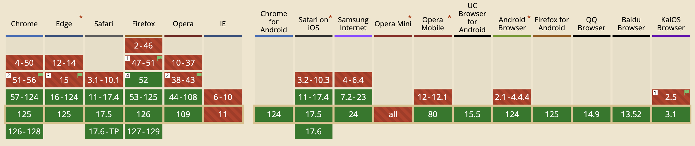
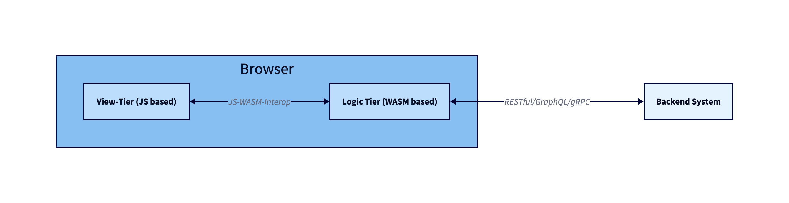

# 


---

# What is WebAssembly

> WebAssembly (abbreviated Wasm) is a binary instruction format for a stack-based virtual machine. Wasm is designed as a portable compilation target for programming languages, enabling deployment on the web for client and server applications.

---

# What is WebAssembly? (cont.)

* Stack-based virtual machine (similar to the JVM or the CIL of .NET)
    * Non object-oriented (only supports simple datatypes)
    * Linear memory - memory is just an `ArrayBuffer` (no GC)
* Compilation target of compiled programming languages
* Sandboxed execution environment
    * Host interaction via imports/exports
    * security checks applied
* W3C standard (1.0)

---

# How to run?

* Built-in browser support: https://caniuse.com/?search=wasm


* Built-in _node.js_ support
* Dedicated / stand-alone interpreters (see later)

---

# Which languages can compile to WASM?

* C/C++ `emscripten`
* Rust _built-in_
* Go _built-in_, `TinyGo`
* C# `Blazor`, `Uno` / F# _community_
* Kotlin _built-in_
* AssemblyScript _native_
* Dart/Flutter _built-in_
* Swift _community_
* Zig _built-in_
* Nim (via generated C-Code)
* ...

--- 

# Why WASM?

* Performance
* Re-use existing (C/C++) code bases
* Hide implementation details (better then JS obfuscation)

---

# Use Case #1: Web Apps

* Re-use existing code bases in browser apps
* Use WASM to provide calculation intense parts of an app
    * signal processing (images, video, audio)
    * Complex calculations (i.e. graphics, 3d models)
    * Weather simulation
    * Games (of course 😀)    
* In use today:
    * Jupyter Notebooks (running full Python interpreter on WASM incl. numpy, ...)
    * Photoshop/Lightroom browser apps (Adobe)
    * Figma
    * TinkerCAD
    * ...

---

# Downsides (Web Apps)

* No built-in API for DOM manipulations
    * Needs JS interaction hooks (slow)
    * Will be refined in upcomining standards draft
* "Fat" binaries
    * No GC built-in -- languages need to ship a custom GC as part of the module
    * No standard lib - languages need to package everything they need

WebAssembly 2.0 (draf) will address some of these with
* reference types
* optional GC to be used to cleanup WebAssembly memory

---

# 3-tier web app architecture



--- 

# WASI - WebAssembly System Interface

* Own spec building on WebAssembly specs
* Same VM/assembly code
* Specs for types/functions that interact with the underlying OS
    * Filesystem
    * I/O streams
* Very early draft (current spec is named "preview1", "preview2" is in dev)

--- 

# Use Case #2: Backend Apps/Serverless/FaaS

* Write portable backend apps/functions targetting WASM/WASI
    * Use any language that can compile to WASM/WASI
* Different VM implementations: wasmtime, WAMR, WasmEdge, wazero, Wasmer, wasmi, wasm3
* Kubernetes devs work on providing k8s for WASM (instead of Containers): FaaS

---

# Downsides (Backend Apps)

* WASI specs early drafts
* Lots of features missing (i.e. direct network access)
* Area of active development

---

# How does a virtual stack machine work

* operands are pushed onto a stack
* Operations pop operands off the stack and push the result back onto the stack
* Function arguments and return values are also passed via the stack

---

# How does a virtual stack machine work (cont.)

`2 + 3`

```lisp
i32.const 2
i32.const 3
i32.add
```

---

# How does a virtual stack machine work (cont.)

`2 + 3`

```lisp
i32.const 2
i32.const 3
i32.add
```

... or equivalent as _S-expressions_

```lisp
(i32.add
    (i32.const 2)
    (i32.const 3)
)
```

---

# How does it look like?

```lisp
(module
    ;; Define a function fib to calculate the n-th fibonacci number in a resource wasting way.
    (func $fib (export "fib") (param i64) (result i64)
        ;; Calculate param < 3
        (i64.lt_u
            (local.get 0)
            (i64.const 3)
        )
        
        ;; If result of comparison is true (!= 0)...
        (if (result i64)
            (then 
                ;; ... then put 1 on the stack ...
                i64.const 1
            )
            (else
                ;; ... otherwise compute fib(param - 1) + fib(param - 2)
                ;; and leave the result on the stack
                (i64.add
                    (call $fib
                        (i64.sub 
                            (local.get 0)
                            (i64.const 1)
                        )
                    )

                    (call $fib
                        (i64.sub 
                            (local.get 0)
                            (i64.const 2)
                        )
                    )
                )
            )
        )        
    )
)
```

---

# Hello, WASI

```lisp
(module
    ;; Import the required fd_write WASI function which will write the given io vectors to stdout
    ;; The function signature for fd_write is:
    ;; (File Descriptor, *iovs, iovs_len, *nwritten) -> Returns 0 on success, nonzero on error
    (import "wasi_snapshot_preview1" "fd_write" (func $fd_write (param i32 i32 i32 i32) (result i32)))

    ;; Reserve 1 page of memory (=64Kb) and export it
    (memory 1)
    (export "memory" (memory 0))

    ;; Write 'hello world\n' to memory at an offset of 8 bytes
    (data (i32.const 8) "hello world\n")

    (func (export "_start")
        ;; Creating a new io vector within linear memory
        (i32.store (i32.const 0) (i32.const 8))  ;; iov.iov_base - This is a pointer to the start of the 'hello world\n' string
        (i32.store (i32.const 4) (i32.const 12))  ;; iov.iov_len - The length of the 'hello world\n' string

        (call $fd_write
            (i32.const 1) ;; file_descriptor - 1 for stdout
            (i32.const 0) ;; *iovs - The pointer to the iov array, which is stored at memory location 0
            (i32.const 1) ;; iovs_len - We're printing 1 string stored in an iov - so one.
            (i32.const 20) ;; nwritten - A place in memory to store the number of bytes written
        )
        drop ;; Discard the number of bytes written from the top of the stack
    )
)
```

---

# How fast is WASM?

Very simple CPU-intensive benchmark:

```js
// Javascript
function fib (x) {
    if (x === 0) return 0;
    if (x < 2) return 1;
    return fib(x-1) + fib(x-2);
}
```

```c
// C
unsigned long long fib(const unsigned long long x) {
    if (x == 0) return 0;    
    if (x < 3) return 1;
    return fib(x-1) + fib(x - 2);
}
```

---

# How fast is WASM? (cont.)

Implementation | Time for `fib(45)` [s] | Size of the binary [kB] | env
-- | --: | --: | --
JavaScript | 6.3 | 0.2 | node v22
C (native; unoptimized) | 4.6 | 33 |macOS
C (native; optimized) | 2.0 | 33 |macOS
C (WASM; unoptimized) | 9.3 | (59 + 13) = 72 | node v22
C (WASM; optimized) | 2.7 | (12 + 6.3) = 18.3 | node v22
WASM (handwritten) | 4.7 | 0.06 | wasmtime

---

# How fast is WASM? (cont.)

Implementation | Time for `fib(45)` [s] | Size of the binary [kB] | env
-- | --: | --: | --
Go (native) | 2.4 | 2,000 | macOS
Go (WASM) | 12.2 | 2,100 | node v22 w/ custom JS
Go (WASM) | 47.2 | 2,100 | wasmtime
TinyGo (WASM) | 2.9 | 603 | node v22 w/ custom JS
TinyGo (WASM) | 2.8 | 603 | wasmtime

---

```js
function fib (x) {
    if (x < 2) return x;
    let a = 0, b = 1;
    for (let i = 2; i <= x; i++) {
        const tmp = a + b; a = b; b = tmp;
    }
    return b;
}
```

Implementation | Time for `fib(45)` [s]
-- | --:
JavaScript | 6.3
C (native; optimized) | 2.0
JavaScript (dynamic programming; bottom up) | 0.05

---

# Live Demo

---

# Stuff to check out

* https://webassembly.org
* https://developer.mozilla.org/en-US/docs/WebAssembly
* https://wasi.dev
* https://www.cncf.io/blog/2024/03/12/webassembly-on-kubernetes-from-containers-to-wasm-part-01/
